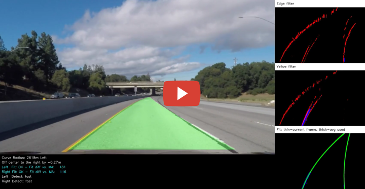

**Advanced Lane Lines Detection**

The goals of this [project](https://github.com/udacity/CarND-Advanced-Lane-Lines) are as follows:

- Compute the camera calibration matrix and distortion coefficients given a set of chessboard images
- Apply a distortion correction to raw images
- Use color transforms, gradients, etc., to create a thresholded binary image
- Apply a perspective transform to rectify binary image ("birds-eye view")
- Detect lane pixels and fit to find the lane boundary
- Determine the curvature of the lane and vehicle position with respect to center
- Warp the detected lane boundaries back onto the original image
- Output visual display of the lane boundaries and numerical estimation of lane curvature and vehicle position

[//]: # (Image References)

[img1]: assets/calibration2.jpg
[img2]: assets/calibration1_undistorted.jpg
[img3]: assets/calibration1.jpg
[img4]: assets/test1_out.jpg
[img5]: assets/test1.jpg
[img6]: assets/straight_lines1-unwarped.jpg
[img7]: assets/straight_lines1-unwarp-drawn.jpg
[img8]: assets/straight_lines1-warped-drawn.jpg
[img9]: assets/straight_lines1-pipeline.jpg


---
### Source Files 

The python source files:

- `lib/calibrate.py` - calibrate camera from images and save calibration matrix and distortion coefficients to `camera_cal.json`
- `lib/camera.py` - calibrated camera interface 
- `lib/np_util.py` - utils
- `lib/draw.py` - drawing functions
- `lib/lane_detection.py` - lane detection
- `lib/line_fit.py` - line fit and detection pipeline
- `test_camera.py` - write images from running `undistort` from `camera.py` to calibration images
- `run.py` - process video by running `process_image` from `line_fit.py` for each image in video if video is provided, otherwise run `process_image` and detection function outputs on test images.

The image paths:

- `camera_cal/` - chessboard images to calibrate camera.
- `output_images/calib_corners/` - corners drawn on chessboard images using calibrated camera matrix
- `output_images/test_images/` - undistorted images using calibrated camera matrix on test images
- `output_images/test_images-unwarped/` - unwarped detection output on test images
- `output_images/test_images-warped/` - warped detection output on test images
- `output_images/test_images-pipeline/` - pipeline output on test images


---
### Camera Calibration

Before we start with the pipeline that processes the images in the video, we need to calibrate the camera. This is needed since the images from the camera are usually distorted due to its lense curvature and other reasons. Calibration here means we want to determine the camera matrix and distortion coefficients that can be used to undistort the images. This is done by feeding chessboard images to `cv2.findChessboardCorners` in `calibrate.py` to obtain all chessboard corners in the image. These corner coordinates in the image are referred to as *image points*.

These image corner coordinates are mapped to their corresponding real world coordinates, which are [[0,0,0], [1,0,0], ..., [8,5,0]] and referred to as *object points*. This mapping will be feed to `cv2.calibrateCamera` to return the camera calibration matrix and distortion coefficients needed.

Here is a sample output of corners detected and drawn:

![][img1]

*Fig 1. Chessboard Corners Drawn*

Here is a different chessboard image after applying `cv2.undistort` function with the obtained camera calibration matrix and distortion coefficients: 

![][img2]

*Fig 2. Undistorted Chessboard Image*

Here is the original distorted image for comparison.

![][img3]

*Fig 3. Distorted Chessboard Input Image*

Here is the undistortion applied to a road image.

![][img4]

*Fig 4. Sample undistorted lane image*

![][img5]

*Fig 5. Original distorted lane image*


---
### Lane Line Pixels Extraction

To extract lane lines, a combination of color and gradient thresholds are used to filter lane line pixels. We then take these lane line pixels to generate a binary image needed for the next step.

The yellow lines are identified using a combination of H and S channels of HSV color space and positive and negative Sobel edges.

The white lines are identified using a combination of V and S channels of HSC color space and positive and negative Sobel edges.

![][img6]

*Fig 6. Sample unwarped lane line pixels image*


---
### Perspective Transform

After the binary lane line image is obtained, perspective transform is performed to turn the first person view image into a bird's eyes view image, which will crop areas outside the region of interest as well.

The code for perspective transform is in `roi_warper()` in `lane_detection.py`. It computes source and destination points from input image as follows.

| x,y Source   | x,y Destination | 
|:-------------:|:-------------:| 
| 220, 698      | 320, 720      | 
| 595, 454      | 320, 0      |
| 685, 454      | 960, 0      |
| 1060, 698     | 960, 720    |

To verified that the perspective transform work as expected, `src` and `dst` points are drawn onto a test image and its warped counterpart to verify that the lines appear parallel in the warped image.

![][img7]

*Fig 7. Sample unwarped image with source points drawn*

![][img8]

*Fig 8. Sample warped image with dest points drawn*


---
### Fit Pixels to a Polynomial

The sliding windows method is used to find where the mean of pixels are within the windows. Once found, a faster method without the sliding windows can be used.

The pixels are fitted to the polynomial equation Ay^2 +By + C.

The curvature radius and center of individual lane lines are calculated in `set_center_and_curve_radius()` in `line_fit.py`. It implements the formula (1 + (2Ay+B)^2 )^1.5 / abs(2A).

![][img9]

*Fig 8. Sample pipeline output image with lane lines identified*


---
### Output Videos

[](https://youtu.be/JcuaSM8Fecc "Advanced Lane Line Detection Project Output (Udacity sdcnd P4)")

*Project Video Output*

[](https://youtu.be/HdnMCPZ0xb4 "Advanced Lane Line Detection Challenge Output(Udacity sdcnd P4)")

*Challenge Video Output*

---
### How to run

```sh
python lib/calibrate.py # calibrate camera from images and save calibration matrix and distortion coefficients to `camera_cal.json`
python test_camera.py # write images in output_images from running `undistort` from `camera.py` to calibration images
python run.py # produces images in output_images from test_images folder
python run.py video_in.mp4 video-out.mp4 # produces project and challenge video outputs
```


---
### Thoughts

So much time has been spent in this project to get the challenge video to work ok that I am actually too embarrassed to mention it. Much of it had to do with manual fine tuning of parameters and debugging. Had I knew of the time involved, I may have chosen to attempt this project with a deep learning approach. Reason being I do not believe this manual approach can get us to a level 5 autonomy. Thus although I gained knowledge in this project, I feel like the time would be better spent on a deep learning approach.
